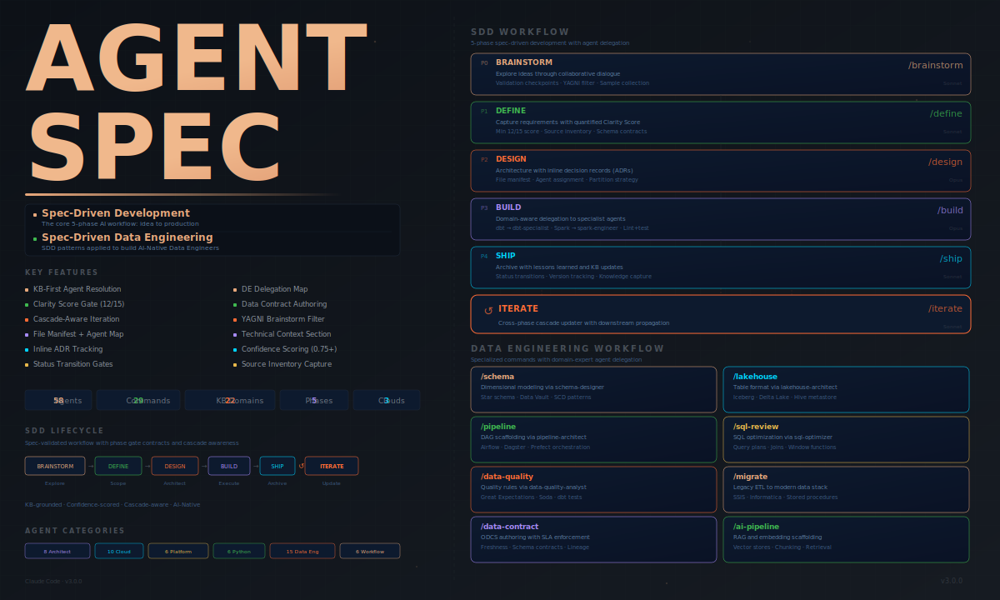

<div align="center">

<picture>
  <source media="(prefers-color-scheme: dark)" srcset="assets/banner.svg">
  <source media="(prefers-color-scheme: light)" srcset="assets/banner.svg">
  
</picture>

<br/><br/>

[](plugin-copilot/)
[](https://github.com/luanmorenommaciel/agentspec)
[](LICENSE)
[](plugin-copilot/manifest.yaml)

**A single AI agent reviewing your data pipeline will miss things.**<br/>
**58 specialized agents with 24 knowledge domains will not.**

<br/>

[Install](#install) · [Quick Start](#quick-start) · [Skills](#which-skill-do-i-need) · [Agents](#58-agents-across-8-categories) · [Docs](docs/)

</div>

<br/>

> **This is a GitHub Copilot CLI port of [AgentSpec](https://github.com/luanmorenommaciel/agentspec), originally created by [@luanmorenommaciel](https://github.com/luanmorenommaciel) for Claude Code.**
> The agents, knowledge base domains, and SDD workflow are identical — only the plugin format and skill wiring were adapted to run on GitHub Copilot CLI.

<br/>

## Why AgentSpec?

Every time you ask an AI to build a data pipeline, it starts from scratch — no memory of partition strategies, no awareness of SCD patterns, no understanding of your data contracts. You get hallucinated SQL, wrong incremental strategies, and pipelines that pass in dev but break in production.

AgentSpec solves this with **Spec-Driven Data Engineering**: a 5-phase workflow where every phase has access to 24 knowledge base domains, every agent knows its boundaries, and every decision is confidence-scored against real documentation — not guessed.

<br/>

## Install

```bash
# Install from a registered marketplace (Recomended)
/plugin marketplace add arthur1511/agentspec-copilot
/plugin install agentspec@agentspec
```

Done. Every Copilot CLI session now has 58 agents, 35 skills, and 24 KB domains. Updates are one command:

```bash
# marketplace install
/plugin update agentspec@agentspec
```

```bash
# Install from a registered marketplace
copilot plugin install agentspec@awesome-copilot

# Local testing (clone and install from disk)
git clone https://github.com/Arthur1511/agentspec-copilot.git
copilot plugin install ./agentspec-copilot/plugin-copilot

# Build from source then install locally
./build-copilot.sh          # Linux / macOS
.\build-copilot.ps1         # Windows (PowerShell)
copilot plugin install ./plugin-copilot
```

</details>

<br/>

## Quick Start

### Build a data pipeline in 5 phases

```bash
/agentspec:brainstorm "Daily orders pipeline from Postgres to Snowflake star schema"
/agentspec:define ORDERS_PIPELINE
/agentspec:design ORDERS_PIPELINE
/agentspec:build ORDERS_PIPELINE
/agentspec:ship ORDERS_PIPELINE
```

### Or jump straight to what you need

```bash
/agentspec:schema "Star schema for e-commerce analytics"
/agentspec:pipeline "Daily orders ETL with Airflow"
/agentspec:data-quality models/staging/stg_orders.sql
/agentspec:sql-review models/marts/
/agentspec:data-contract "Contract between orders team and analytics"
```

<br/>

## Which Skill Do I Need?

### Data Engineering

| I want to... | Skill | Agent |
|:--|:--|:--|
| Design a data pipeline / DAG | `agentspec:pipeline` | `architect-pipeline` |
| Design a star schema / data model | `agentspec:schema` | `architect-schema-designer` |
| Add data quality checks | `agentspec:data-quality` | `test-data-quality-analyst` |
| Optimize slow SQL | `agentspec:sql-review` | `de-sql-optimizer` |
| Choose Iceberg vs Delta Lake | `agentspec:lakehouse` | `architect-lakehouse` |
| Build a RAG / embedding pipeline | `agentspec:ai-pipeline` | `de-ai-data-engineer` |
| Create a data contract | `agentspec:data-contract` | `test-data-contracts-engineer` |
| Migrate legacy SSIS / Informatica | `agentspec:migrate` | `de-dbt-specialist` + `de-spark-engineer` |

### SDD Workflow

| I want to... | Skill | What Happens |
|:--|:--|:--|
| Explore an idea | `agentspec:brainstorm` | Compare approaches, discovery questions, YAGNI filter |
| Capture requirements | `agentspec:define` | Structured requirements with clarity score (min 12/15) |
| Design architecture | `agentspec:design` | File manifest + pipeline architecture + ADRs |
| Implement the feature | `agentspec:build` | Auto-delegates to specialist agents per file type |
| Archive completed work | `agentspec:ship` | Lessons learned + KB updates |
| Update after changes | `agentspec:iterate` | Cascade-aware updates across all phase documents |

### Visual & Utilities

| I want to... | Skill |
|:--|:--|
| Generate architecture diagrams | `agentspec:generate-web-diagram` |
| Create presentation slides | `agentspec:generate-slides` |
| Visual implementation plan | `agentspec:generate-visual-plan` |
| Review code changes visually | `agentspec:diff-review` |
| Review code | `agentspec:review` |
| Analyze meeting transcripts | `agentspec:meeting` |
| Create a new KB domain | `agentspec:create-kb` |
| Share HTML page via Vercel | `agentspec:share` |

<br/>

## How It Works

```
  BRAINSTORM ──► DEFINE ──► DESIGN ──► BUILD ──► SHIP
  Explore ideas   Scope &    File       Agent      Archive &
  & approaches    contracts  manifest   delegation lessons

                                │
          ┌─────────────────────┼──────────────────────┐
          ▼                     ▼                      ▼
    ┌───────────┐        ┌───────────┐          ┌───────────┐
    │ dbt-spec  │        │ spark-eng │          │ pipeline  │
    │ Models    │        │ Jobs      │          │ DAGs      │
    └─────┬─────┘        └─────┬─────┘          └─────┬─────┘
          └────────────────────┼──────────────────────┘
                               ▼
                         BUILD REPORT
                         Tests + Quality Gates

                          ↻ agentspec:iterate
                    Cascade-aware updates
```

**Agent matching:** Your DESIGN doc specifies dbt staging models, a PySpark job, and an Airflow DAG — AgentSpec automatically delegates to `de-dbt-specialist`, `de-spark-engineer`, and `architect-pipeline`.

**Requirements changed?** `agentspec:iterate` updates any phase document with automatic cascade detection across all downstream docs.

<br/>

## 58 Agents Across 8 Categories

| Category | Count | Focus |
|:--|:--|:--|
| **Architect** | 8 | Schema design, pipeline architecture, medallion layers, GenAI systems |
| **Cloud** | 10 | AWS Lambda, GCP Cloud Run, Supabase, CI/CD, Terraform |
| **Data Engineering** | 15 | dbt, Spark, Airflow, streaming, Lakeflow, SQL optimization |
| **Platform** | 6 | Microsoft Fabric end-to-end (architecture, pipelines, security, AI, logging, CI/CD) |
| **Python** | 6 | Code review, documentation, cleaning, prompt engineering |
| **Workflow** | 6 | Brainstorm, define, design, build, ship, iterate |
| **Dev** | 4 | Codebase exploration, shell scripting, meeting analysis, prompt crafting |
| **Test** | 3 | Test generation, data quality analysis, data contract authoring |

Every agent follows the same cognitive framework:

1. **KB-first** — check local knowledge base before external sources
2. **Confidence-scored** — calculate confidence from evidence, never self-assess
3. **Escalation-aware** — transfer to the right specialist when out of domain
4. **Quality-gated** — pre-flight checklist before every substantive response

<br/>

## 24 Knowledge Base Domains

| Category | Domains |
|:--|:--|
| **Core DE** | `dbt` · `spark` · `sql-patterns` · `airflow` · `streaming` |
| **Data Design** | `data-modeling` · `data-quality` · `medallion` |
| **Infrastructure** | `lakehouse` · `lakeflow` · `cloud-platforms` · `terraform` |
| **Cloud** | `aws` · `gcp` · `microsoft-fabric` |
| **AI & Modern** | `ai-data-engineering` · `modern-stack` · `genai` · `prompt-engineering` |
| **Foundations** | `pydantic` · `python` · `testing` · `supabase` · `xgboost` |

Each domain contains an `index.md`, `quick-reference.md`, `concepts/` (3-6 files), and `patterns/` (3-6 files with production code). Agents load domains on-demand, not upfront.

<br/>

## 5-Phase Workflow with Quality Gates

| Phase | Skill | Output | Gate |
|:--|:--|:--|:--|
| **0. Brainstorm** | `agentspec:brainstorm` | `BRAINSTORM_{FEATURE}.md` | 3+ questions, 2+ approaches |
| **1. Define** | `agentspec:define` | `DEFINE_{FEATURE}.md` | Clarity Score >= 12/15 |
| **2. Design** | `agentspec:design` | `DESIGN_{FEATURE}.md` | Complete manifest + schema plan |
| **3. Build** | `agentspec:build` | Code + `BUILD_REPORT.md` | All tests pass |
| **4. Ship** | `agentspec:ship` | `SHIPPED_{DATE}.md` | Acceptance verified |

<br/>

## Project Structure

```
agentspec-copilot/
├── .github/                 # Source of truth for Copilot CLI
│   ├── agents/              # 58 *.agent.md files (flat directory)
│   ├── skills/              # 35 skill directories (each with SKILL.md)
│   ├── kb/                  # 24 KB domain directories + _index.yaml
│   ├── sdd/                 # Templates, contracts, features, archive
│   ├── copilot-instructions.md  # Copilot CLI system prompt
│   └── manifest.yaml        # Plugin manifest
│
├── plugin-copilot/          # Distributable Copilot CLI extension (generated)
│   ├── agents/              # Path-rewritten agents
│   ├── skills/              # All 35 skills
│   └── ...                  # kb, sdd, manifest
│
├── build-copilot.sh         # Packages .github/ → plugin-copilot/ (Linux/macOS)
├── build-copilot.ps1        # Packages .github/ → plugin-copilot/ (Windows)
├── assets/                  # Banner and visual assets
└── docs/                    # Getting started, concepts, tutorials, reference
```

> **Never edit `plugin-copilot/` directly** — it is a generated artifact. All changes go into `.github/`.

<br/>

## Documentation

| Guide | What You'll Learn |
|:--|:--|
| [Getting Started](docs/getting-started/) | Install and build your first data pipeline |
| [Core Concepts](docs/concepts/) | SDD pillars through a data engineering lens |
| [Tutorials](docs/tutorials/) | dbt, star schema, data quality, Spark, streaming, RAG |
| [Reference](docs/reference/) | Full catalog: 58 agents, 35 skills, 24 KB domains |

<br/>

## Contributing

We welcome contributions. See [CONTRIBUTING.md](CONTRIBUTING.md) for guidelines.

**Agents** · **KB Domains** · **Skills** · **Plugin Development** · **Documentation**

<br/>

## License

MIT — see [LICENSE](LICENSE).

---

<div align="center">

[Documentation](docs/) · [Contributing](CONTRIBUTING.md) · [Security](SECURITY.md)

Built for [GitHub Copilot CLI](https://docs.github.com/en/copilot/github-copilot-in-the-cli) · Based on [AgentSpec for Claude Code](https://github.com/luanmorenommaciel/agentspec) by [@luanmorenommaciel](https://github.com/luanmorenommaciel)

</div>
